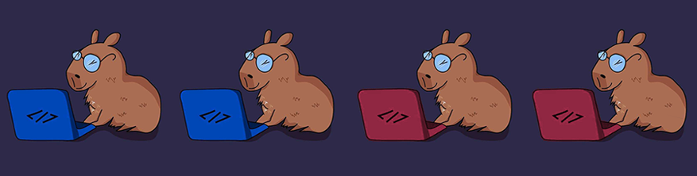
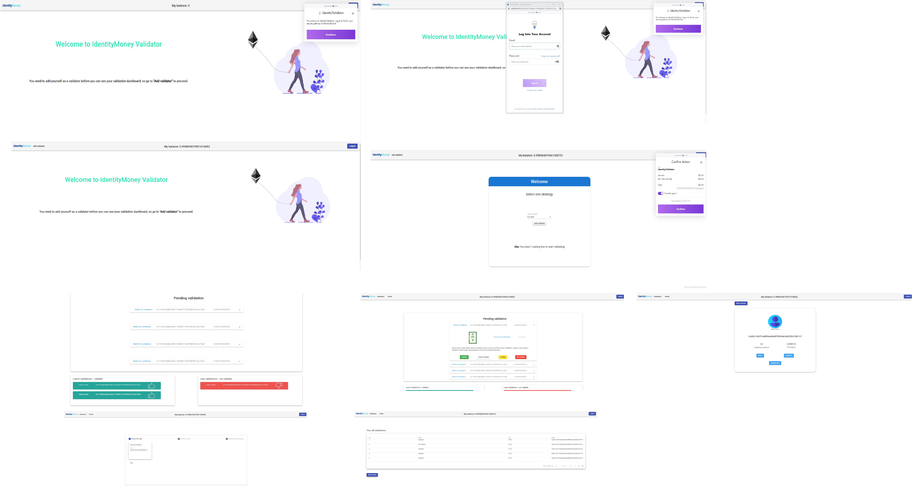

<p align="center">
    
</p>

<p>
  <strong>IdentityMoney</strong> is a project to manage your identity in a decentralized way. The protocol was create to save user's data in Blockchain and give the power to the <i>user to control they own data</i>. This is an open source project, developed for presentation at HackMoney 2020, it can be used as a protocol for new application models.
  The basis of this module are smart contracts, created to save and manage the user's data and relationship between users, validators and consumers.
</p>



### User Story

As a Validator

- I can access the Portis dApp, create a new wallet or import an existing wallet.
- I can validate datas of other people.
- I can make validations free or charge.
- I can make cash outs on the validations charged

### Behavior

This screen need you first make login with portis

- **Screen: Add validator**
In this screen the user can if add validator

These screens need you to first add as validator

- **Screen: Peding validation**
In this screen the user view peding validation and last validations, so he can validate the datas.

- **Screen: Validations**
In this screen the user can view all validations mad

- **Screen: Profile**
In this screen the user can view their wallet, status and access for request loot

- **Screen: Request loot**
In this screen the user can request loot their validations


- **Menu IdentityMoney Validator**

 Option | Description |
 ------ |------|
Login |can make login with portis|
Add validator |can add as validator for have the access dashboard|
Validations |can view all validations completed|
Profile|can view wallet and status active/disabled or request loot|

## Pre Requirements

- It is necessary install [Node](https://nodejs.org/en/), [Npm](https://www.npmjs.com/) and [Ng](https://cli.angular.io/).

## How to Install

To install in developer mode, follow the step-by-step:
1. Download the repository on your computer. 
2. Access the directory where you downloaded this project and run the command below.
```sh
  $ npm install
  $ npm install -g @angular/cli
  $ npm install @portis/web3
```

## How to Run

Run the command below for generate build on your project.
```sh
 $ npm start
```

## Tech
To build this application was used:

 Technologies | Version |
 ------ |------|
  Angular  | 9.1.7 |
  Angular material | 9.2.4 |